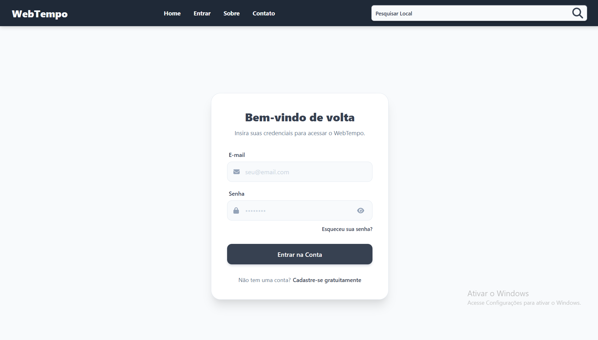
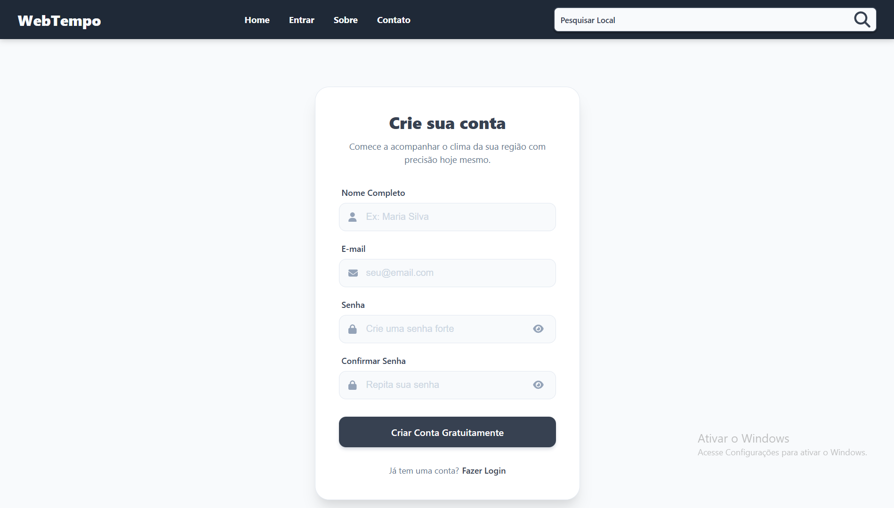

# 🌦️ WebTempo

Precisão meteorológica aliada a uma experiência moderna.

## 📖 Sobre o Projeto

O WebTempo é uma aplicação Full Stack desenvolvida para fornecer dados meteorológicos em tempo real, previsões detalhadas e gerenciamento de localidades favoritas.

O projeto foi arquitetado para simular um ambiente próximo de produção, utilizando:

Arquitetura Headless (Frontend desacoplado do Backend)

Cache distribuído com Redis

Autenticação segura via JWT (Cookies HttpOnly)

Integração com APIs externas de clima e geolocalização

Toda a aplicação é executada via Docker, garantindo reprodutibilidade, isolamento e facilidade de setup.
 
## 🎯 Objetivo

Este projeto nasceu como um desafio técnico e educacional, com foco em:

Arquitetura de aplicações Full Stack

Autenticação segura e stateless

Consumo e cache de APIs externas

Uso de Docker em ambiente de desenvolvimento

Boas práticas de organização e configuração de projetos

📸 Screenshots
<div align="center">  <p><em>Página Inicial do WebTempo</em></p> </div> <div align="center">  <p><em>Página de Login</em></p> </div> <div align="center">  <p><em>Página de Registro</em></p> </div> <div align="center">  <p><em>Página de Perfil</em></p> </div> <div align="center">  <p><em>Previsão do Tempo</em></p> </div> <div align="center">  <p><em>Detalhes da Previsão</em></p> </div>

# ✨ Funcionalidades Principais

## 🌍 Geolocalização Inteligente
Detecção automática da localização inicial do usuário.

## 🔍 Busca Global de Cidades
Busca otimizada com integração à API do Geonames.

## 📊 Dashboard Meteorológico

Temperatura atual e sensação térmica

Umidade, vento, UV, visibilidade e pressão

Previsão hora a hora

Resumo dos próximos dias

## ⭐ Sistema de Favoritos
Salve e gerencie cidades favoritas.

## 🔐 Autenticação Completa

* Registro

* Login

* Logout

* Recuperação e alteração de senha via e-mail

* JWT via Cookies HttpOnly

# 🛠️ Tecnologias e Arquitetura
## 💻 Frontend

* React + Vite

* Styled Components

* TanStack Query (React Query)

* Axios

* Chart.js

* Weather Icons React

⚙️ Backend

* Python + Django

* Django REST Framework

* MySQL

* Redis

* JWT (SimpleJWT + dj-rest-auth)

* Whitenoise

## ☁️ APIs Externas

* Tomorrow.io – Dados meteorológicos

* Geonames – Busca e geolocalização de cidades


# 🐳 Como Rodar o Projeto (Docker)
## ✅ Pré-requisitos

* Docker

* Docker Compose

Não é necessário instalar Python, Node.js, MySQL ou Redis localmente.

## 📥 1. Clonar o Repositório

```
git clone https://github.com/Enzo1rocha/WebTempo_Previsao_do_Tempo.git
cd WebTempo_Previsao_do_Tempo
```

## ⚙️ 2. Configurar Variáveis de Ambiente

Crie um arquivo .env na raiz do projeto (ou conforme definido no docker-compose.yml):

### Django
* DEBUG=True
* SECRET_KEY=django-insecure-change-me

### Banco de Dados (MySQL)
* USE_MYSQL=True
* DB_NAME=webforecast
* DB_USER=root
* DB_PASSWORD=12345678
* DB_HOST=mysql
* DB_PORT=3306

### Redis
* REDIS_URL=redis://redis:6379/1

### CORS / Frontend
* FRONTEND_URL=http://localhost:5173
* ORIGEM_URL=http://localhost:8001
* ALLOWED_HOSTS=backend,localhost,127.0.0.1

### APIs Externas
* TOMORROW_API_KEY=sua_chave_tomorrow_io
* GEONAMES_USERNAME=seu_usuario_geonames

### Email (Gmail - App Password)
* EMAIL_HOST_USER=seu_email@gmail.com
* EMAIL_PASSWORD=sua_senha_de_app_google

## ▶️ 3. Subir a Aplicação
```
docker compose --profile db up --build
```

Isso irá subir automaticamente:

* Backend (Django)

* Frontend (React)

* MySQL

* Redis

## 🧱 4. Rodar as Migrações

Em outro terminal:

```
docker compose exec backend python manage.py migrate
```

## 🌐 Acessos

* Frontend: http://localhost:5173

* Backend (API): http://localhost:8001


# 🚀 Status do Projeto

## ✅ Versão 1.0

* Autenticação completa

* Clima em tempo real

* Favoritos

* Cache com Redis

* Dockerizado

<p align="center"> Feito com 💙 por <a href="https://github.com/enzo1rocha">Enzo Rocha</a> </p>