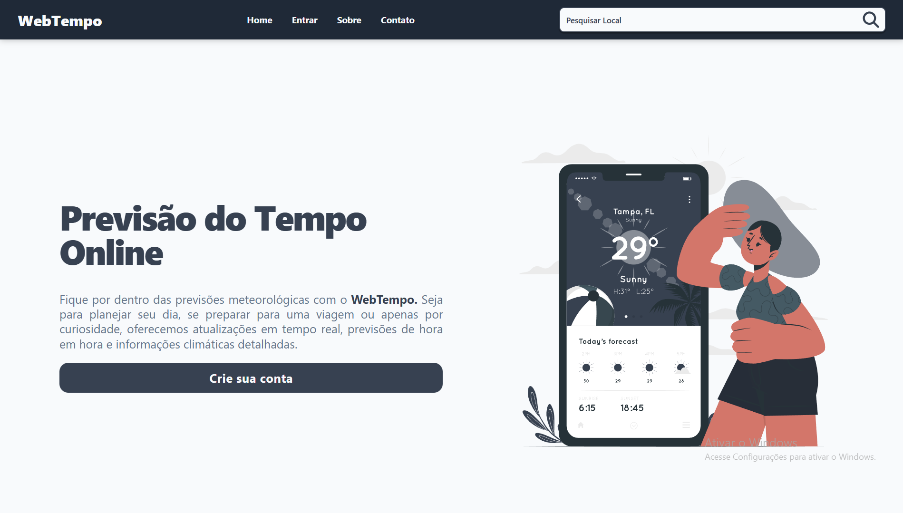
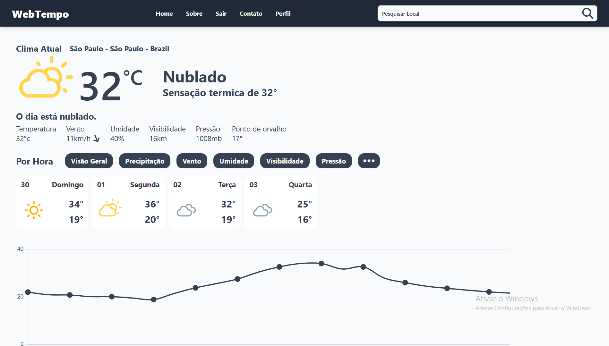

🌦️ WebTempo

Precisão meteorológica aliada a uma experiência moderna.

📖 Sobre o Projeto

O WebTempo é uma aplicação Full Stack desenvolvida para fornecer dados meteorológicos em tempo real, previsões detalhadas e gerenciamento de localidades favoritas.

Diferente de simples apps de clima, este projeto foi arquitetado para simular um ambiente de produção robusto, utilizando cache distribuído (Redis) para alta performance e uma arquitetura Headless (Desacoplada), separando a lógica de negócios no Backend da interface interativa no Frontend.

🎯 Objetivo

O projeto nasceu como um desafio técnico para consolidar conhecimentos em integração de sistemas, autenticação segura (JWT), consumo de APIs externas e otimização de requisições.

📸 Screenshots

<em>Página Inicial do WebTempo</em>

<em>Página de Login do WebTempo</em>

<em>Página de Registro do WebTempo</em>

<em>Página de Perfil do WebTempo</em>

<em>Página da Previsão do WebTempo</em>

<em>Página da Previsão do WebTempo</em>

<!-- Adicione mais imagens aqui futuramente, como o Dashboard ou Perfil -->

✨ Funcionalidades Principais

Com base na geolocalização e integração com a API da Tomorrow.io, o sistema oferece:

🌍 Geolocalização Inteligente: Detecção automática da posição inicial do usuário ao se cadastrar para entregar o clima local imediatamente.

🔍 Busca Global: Algoritmo de busca otimizado para encontrar cidades e localidades em todo o mundo (integração Geonames).

📊 Dashboard Meteorológico:

Temperatura atual e Sensação Térmica.

Métricas detalhadas: Umidade, Vento, UV, Visibilidade e Pressão.

Previsão hora a hora (24h) com gráficos intuitivos.

Resumo da previsão para os próximos dias.

⭐ Sistema de Favoritos: Usuários autenticados podem salvar suas cidades preferidas para acesso rápido.

🔐 Autenticação Completa: Sistema seguro de Registro, Login, Recuperação de Senha (via E-mail) e Alteração de Senha.

🛠️ Tecnologias e Arquitetura

O projeto segue uma arquitetura RESTful API, onde o Frontend consome dados JSON fornecidos pelo Backend.

💻 Frontend (Client-Side)

Construído para ser reativo e performático.

React + Vite: Core da aplicação (SPA).

Styled Components: Estilização modular e dinâmica (CSS-in-JS).

TanStack Query (React Query): Gerenciamento de estado do servidor e cache no cliente.

Axios: Cliente HTTP otimizado.

Chart.js: Visualização de dados em gráficos.

Weather Icons React: Ícones dinâmicos baseados nas condições climáticas.

⚙️ Backend (Server-Side)

Focado em segurança e performance.

Python + Django: Framework principal.

Django REST Framework (DRF): Construção da API.

MySQL: Banco de dados relacional para persistência de usuários e preferências.

Redis: Sistema de Cache para armazenar respostas da API externa (reduz latência e custos de API).

JWT (JSON Web Tokens): Autenticação segura e stateless.

Gunicorn & Whitenoise: Preparação para ambiente de produção.

☁️ APIs Externas

Tomorrow.io: Fonte de dados climáticos.

Geonames: Base de dados geográfica para busca de cidades.

🚀 Status do Projeto

✅ Versão 1.0: Funcionalidades principais implementadas (Auth, Clima em Tempo Real, Favoritos).

Feito com 💙 por <a href="https://www.google.com/search?q=https://github.com/enzo1rocha">Enzo Rocha</a>

